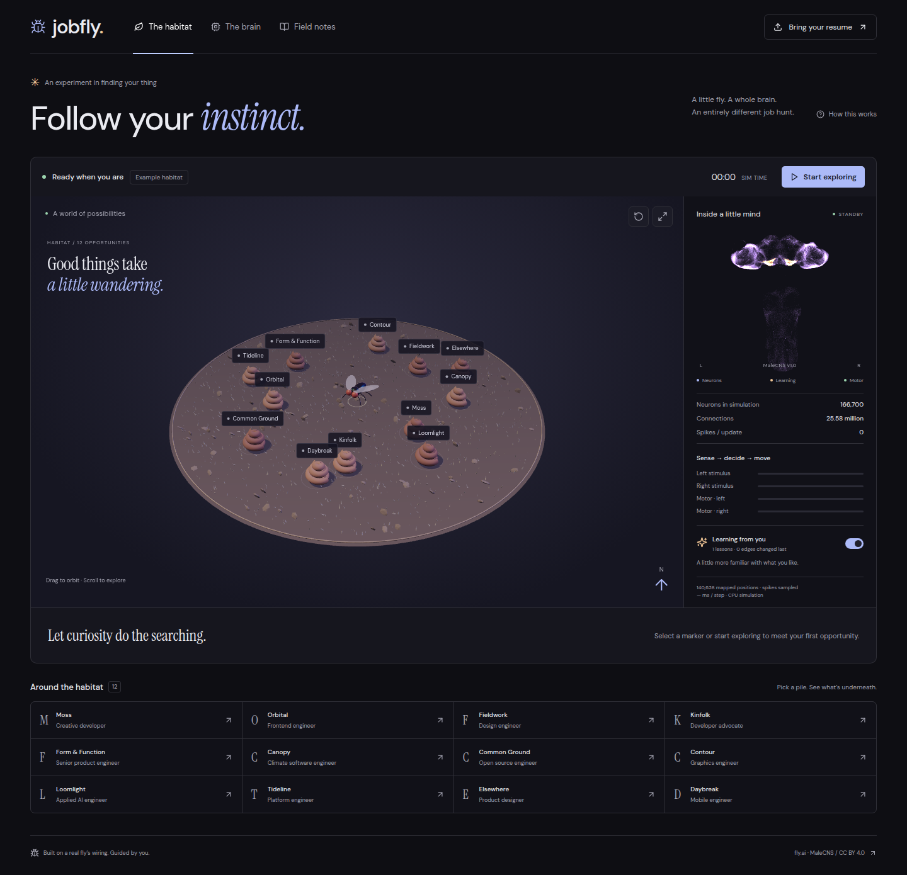
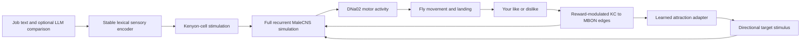

# Jobfly

**A little fly. A whole brain. An entirely different job hunt.**

[Explore the habitat →](https://fly.jsonresume.org)



A fruit fly wanders through a miniature world of job-poop. When it lands,
you decide whether the opportunity is worth your time. Your feedback changes
connections in its simulated brain, influencing what it explores next.

The habitat and neural HUD are built with **Three.js**. The simulation uses all
**166,700 neurons and 25,582,938 connections** in fly.ai's MaleCNS model.

## What you can do

- Watch the fly explore; drag the habitat or brain to orbit, scroll to zoom.
- Inspect a pile or use the accessible job list. “Catch its attention” supplies
  a target stimulus; the neural motor signal still steers the fly there.
- Like or pass **after landing**. Only explicit human feedback supplies reward.
- Add a reason, review your field notes and export your liked opportunities.
- Import a JSON Resume to fetch matches from JSON Resume, or import saved jobs.
- Optionally run an LLM interpreter over the jobs, resume and written feedback.

Bundled companies and jobs are clearly labelled **fictional examples**. Nothing
applies to a job, contacts an employer or changes your JSON Resume account.

## Run locally

Requires Node.js 22+, Python 3.12, and about 2 GB free for dependencies and model
data. A multi-core CPU helps; simulation time is shown separately from wall time.

```sh
npm ci
uv venv --python 3.12 .venv
uv pip install --python .venv/bin/python -r backend/requirements.lock

# Set these to a suitable persistent data disk on your machine.
export FLY_DATA=/path/to/data/jobfly/brain
export JOBFLY_STATE=/path/to/data/jobfly/state
export NUMBA_NUM_THREADS=2
export OPENBLAS_NUM_THREADS=1

npm run brain:setup  # downloads MaleCNS v1.0 and builds the sparse model
npm run build
npm run server      # http://127.0.0.1:8787
```

For frontend development, run `npm run dev` alongside the server. Vite uses
port 5187 and proxies `/api` to 8787. First visit loads the connectome and
compiles the simulation kernel; subsequent steps use the compiled kernel.
The UI remains available while the brain wakes up. An idle/disconnected
browser does not advance the simulation.

### Real jobs

Choose **Bring your resume → JSON Resume**. This sends the selected resume to
`https://registry.jsonresume.org/api/v1/jobs` for matching. Local-file import
does not mean offline matching. No API credential is needed for this endpoint.

Alternatively, import an array or `{ "jobs": [...] }` with job objects:

```json
[{"id":"role-123","company":"Company name","title":"Role title",
  "description":"The actual posting text","location":"Remote",
  "salary":"As posted","url":"https://example.com/original-posting"}]
```

Your job snapshot, marks, reasons and plasticity checkpoint are stored in a
private SQLite database under `JOBFLY_STATE`. Browser sessions use signed,
HttpOnly, SameSite cookies. Keep the cookie to return to your learned fly.
Clearing cookies creates a new identity; it does not delete existing history.

### Optional language model

Set `OPENAI_API_KEY` on the server and optionally `JOBFLY_LLM_MODEL` (default
`gpt-4.1-mini`). The Field notes page then offers **Interpret this habitat**.
This explicit action sends jobs, the imported resume and written feedback to
the configured model and can incur API charges. Nothing calls an LLM per tick.
The public deployment leaves this disabled unless deliberately configured.

Responses use the official OpenAI SDK's schema-validated Pydantic output.
No free-text JSON scraping or hardcoded keyword classification is used.
Written reasons are saved immediately but only influence sensory encoding
when the interpreter is explicitly run. Likes/dislikes train immediately.

## How the brain participates



- **Neurons:** upstream leaky integrate-and-fire dynamics, original sparse
  connectome, full population, 20 ms simulated steps. CPU execution is the
  supported learning backend; swapping to CUDA requires synchronizing plastic
  weight updates with the GPU matrix first.
- **Sensory interface:** character n-grams are hashed into a fixed lexical
  space and projected into sparse Kenyon-cell ensembles. This mapping remains
  stable across job imports. It is an artificial input channel, not a biological
  model of smell. An optional LLM can supply richer grounded comparison text.
- **Movement:** lateral LC10a stimulation flows through the model to DNa02
  steering neurons. A simple kinematic body converts the left/right activity
  difference into turning. Forward locomotion is a constant body-controller
  component, and the world wraps at its boundaries.
- **Learning:** recent firing in the presented Kenyon-cell ensemble determines
  eligibility. A reward strengthens or weakens existing KC → MBON connections,
  bounded to 0.25–2 times their original magnitude. Signs and topology remain
  intact. No new anatomical connections are invented.
- **Attraction:** an explicit adapter reads modified circuit strengths to bias
  stochastic target selection. Target selection is not solely an emergent
  biological decision. The full recurrent simulation controls steering.
- **Visualization:** Three.js renders all 140,638 neurons with measured positions.
  Activity packets sample at most 3,500 mapped spikes; the HUD reports the total
  spike count separately. Unmapped neurons still participate in simulation.

This is an engineered, connectome-based experiment. It is **not a validated
dopamine-learning model**, not an emulation of a complete living animal, and
not evidence that fly wiring improves job matching. Broader recommendation
quality and generalization need a held-out evaluation against simpler models.

## Verification

```sh
npm run build
npm test
CHROME_PATH=/path/to/chrome node scripts/verify-browser.mjs
```

Unit tests cover reward specificity, weight bounds/sign preservation, stable
sensory identity, persisted learning, signed sessions and import validation.
The browser verifier uses the actual running brain: landing, feedback,
changed weights, pause, job import, reload and desktop/mobile screenshots.
It uses an independent session and never uploads a personal resume.

## Deployment

The repository includes a multi-stage `Dockerfile`, a Podman Quadlet, and a
Caddy site in `deploy/`. Build `localhost/jobfly:latest`, mount model data
read-only at `/brain` and persistent session storage at `/state`, then install
the Quadlet. The provided origin binds to `127.0.0.1:8788`; Caddy serves
`fly.jsonresume.org` with automatic TLS and unbuffered SSE.

Three resident brains maximum; disconnected sessions can be evicted and reload
their saved learning. The Quadlet limits the service to 3 GB RAM and two CPU
cores worth of time. This is a small experimental deployment, not a horizontally
scaled service. `/healthz` checks model-file presence; a moving simulation must
be verified through an actual session, not inferred from that health check.

## Credits

Built on [alextitonis/fly.ai](https://github.com/alextitonis/fly.ai), pinned to
`f05a7eae64e4cf4459396743052d368f0e2a3e51`, and
[JSON Resume](https://jsonresume.org). See [THIRD_PARTY.md](THIRD_PARTY.md) for
MaleCNS/FlyEM attribution, separate CC BY 4.0 data terms and upstream credits.

Code: MIT. Connectome data is downloaded separately and never committed.
