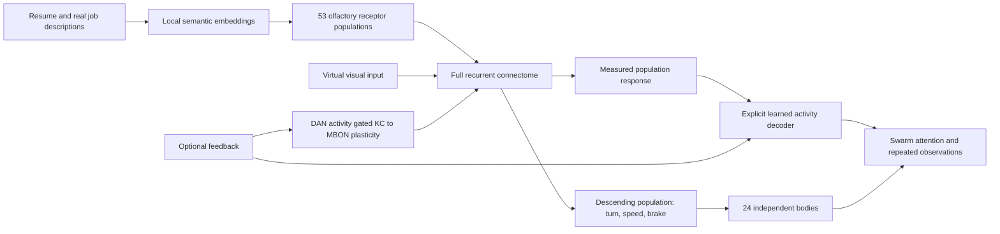

# Jobfly

**A world of real jobs. A swarm with time to explore.**

[Start a session →](https://fly.jsonresume.org)


Twenty-four flies explore a world of real job-poop. They compare opportunities,
revisit promising patches, land, linger, and carry on. **Worth a look** stays quiet
for at least two minutes of simulation and only surfaces jobs checked by three
or more flies. No feedback is required to keep the ecosystem moving.

The habitat and neural HUD are built with **Three.js**. Every fly independently simulates all **166,700 neurons and 25,582,938
connections** in fly.ai's MaleCNS model: **24 brains**, or 4,000,800 neuron
states. They share read-only anatomy, never voltage, spike history, random streams,
learned weights, or fitted job decoders.

## What you can do

- Upload PDF, DOCX, TXT, or JSON Resume, paste JSON, or use Thomas Davis’s published resume.
- Review and edit the resulting `resume.json`, then download it or start searching.
- Get a unique `/s/<random-token>` URL that restores your resume, jobs, and learning in another browser.
- Explore real job listings in Three.js; open the source posting and inspect the brain HUD.
- Like or pass on any job, whenever you want. Each fly receives the feedback as its own sensory/reward event and updates its own existing learning-circuit connections.
- Keep notes and export liked jobs. No applications are submitted and no employers are contacted.

There are no bundled example jobs and no arbitrary job-import endpoint.

## Run locally

Requires Node.js 22+, Python 3.12, and about 2 GB free for dependencies and model
data. A multi-core CPU helps; simulation time is shown separately from wall time.

```sh
npm ci
uv venv --python 3.12 .venv
uv pip install --python .venv/bin/python -r backend/requirements.lock

# Set these to a suitable persistent data disk on your machine.
export FLY_DATA=/path/to/data/jobfly/brain
export JOBFLY_STATE=/path/to/data/jobfly/state
export NUMBA_NUM_THREADS=2
export OPENBLAS_NUM_THREADS=1
export JOBFLY_EMBED_CACHE=/path/to/data/jobfly/embeddings
export JOBFLY_JOB_VECTOR_CACHE=/path/to/data/jobfly/job-vectors.sqlite

npm run brain:setup  # downloads MaleCNS v1.0 and builds the sparse model
.venv/bin/python scripts/setup-embeddings.py
npm run build
npm run server      # http://127.0.0.1:8787
```

For frontend development, run `npm run dev` alongside the server. Vite uses
port 5187 and proxies `/api` to 8787. Opening a session loads the connectome and
compiles the simulation kernel; subsequent steps use the compiled kernel.
The UI remains available while the brain wakes up. An idle/disconnected
browser does not advance the simulation.

### Real jobs and session links

The first screen requires a resume. JSON Resume's matching API supplies up to
500 postings when available. The public [Arbeitnow feed](https://www.arbeitnow.com/blog/job-board-api)
adds up to 12 pages, cached for an hour and deduplicated by posting URL. The live
feed returned **1,491 unique listings** during development; the count varies.
There is no synthetic padding and no top-20 truncation. Mostly European jobs;
check location and requirements. Every job links to its original posting.
Availability can change after import; a session retains its imported catalog.

The world renders every imported job. Distant jobs and flies use lightweight
sprites; up to 200 nearby jobs resolve into instanced 3D meshes. Nearby fly parts
are instanced across the swarm. Twelve reusable labels, raycast picking,
pan/orbit/zoom, and a searchable paginated list keep thousands of jobs navigable.
Canvas data attributes expose rendered job count, draw calls, triangles, and FPS.

Session links contain 192-bit random tokens. **Anyone with a link can read the
resume and update that session.** Keep links private; there is no account login.
Each session has append-only SQLite checkpoints under `JOBFLY_STATE`. Immutable, compressed catalog/vector objects are reused between checkpoints. Public job embeddings are cached across sessions; resumes are not shared.
Responses are not cached, session pages are marked noindex, referrers are suppressed,
and application access logging is disabled. Checkpoints retain each brain's voltages, spikes, RNG state, learned weight overlays, readout, body, unfinished measurements, matched controls, and pending feedback. Server restarts restore these states and session URLs.
The home page does not allocate a brain or load Three.js.

### Document conversion

PDF text is extracted using pypdf; DOCX uses python-docx, including table text.
Scanned PDFs without text are rejected with an explanation. Files are limited to
5 MB, PDFs to 30 pages, and extracted text to 60,000 characters. Original documents
are processed in memory and not retained. JSON files bypass the model unchanged.

Set `OPENROUTER_API_KEY` or `JOBFLY_CONVERSION_KEY_FILE` for document conversion.
The OpenAI SDK submits a required Pydantic-validated tool call through OpenRouter,
using `openrouter/free` by default. Provider price limits are
pinned to zero, including when `JOBFLY_CONVERSION_MODEL` overrides the model.
Free-provider capacity varies; errors preserve the local review state and invite retry.
Two conversions can run at once; public conversion/session creation is rate limited.
The upload screen discloses the provider. Users review extracted facts before saving.

### Optional language model

Set `OPENAI_API_KEY` on the server and optionally `JOBFLY_LLM_MODEL` (default
`gpt-4.1-mini`). The Saved jobs page then offers **Compare jobs**.
This explicit action sends jobs, the imported resume and written feedback to
the configured model and can incur API charges. Nothing calls an LLM per tick.
The public deployment leaves this disabled unless deliberately configured.

Responses use the official OpenAI SDK's schema-validated Pydantic output.
No free-text JSON scraping or hardcoded keyword classification is used.
Written reasons are saved immediately but only influence sensory encoding
when the interpreter is explicitly run. Likes/dislikes queue teaching events immediately; each individual processes them through its own circuit. The HUD reports completion.

## How the brain participates



- **Full circuit per fly:** 166,700 LIF neurons, 25,582,938 signed connections,
  20 ms steps. All 24 brains advance once per world step, including resting flies.
  Operating brains never reset between jobs, turns, observations, or feedback.
- **Independent state:** each fly has its own voltages, spikes, RNG stream, learned
  synaptic overlay, job readout, eligibility/measurement traces and body. The common
  anatomical matrix is immutable; each effective matrix is `W_i = W_base + delta_i`.
  This avoids storing identical anatomical constants 24 times. It does not couple
  the simulations. Numerical equivalence is checked against explicit weight copies.
- **Senses:** local MiniLM embeddings encode overlapping job-description chunks.
  A fixed projection drives 53 actual ORN populations. Each individual experiences
  the resume through its own circuit. Directly injected neurons cannot contribute
  to its job-response readout.
- **Matched controls:** for every resume/job/visual observation, a temporary control
  starts from that individual's exact state and RNG and advances without the
  stimulus. Stimulated minus unstimulated population activity isolates the response
  from ongoing noise. The actual fly retains its continuous state. Controls are
  experimental comparisons, not additional visible flies or replacement brains.
- **Decision:** an engineered 512-dimensional population projection and private
  kernel decoder turn each fly's measured responses into job preferences. User
  ratings fit that fly's own decoder. Coverage, proximity and communicated job
  observations schedule exploration; they are engineered behavior, not discoveries
  of biological swarm intelligence. Consensus averages each observer's latest value.
- **Movement:** an engineered readout of 1,314 descending neurons produces turn,
  speed and brake commands. A separate calibration specimen supplies the same fixed
  virtual-body decoder to every fly. It uses continuous activity and matched visual
  controls, never job labels. Body geometry converts commands into movement.
- **Learning:** likes/passes are queued separately for each individual. Each fly
  experiences the job, then a 12-step PAM/PPL1 input. Measured KC, MBON and modulator
  activity gates that fly's bounded existing-edge update. Weights and fitted job
  decoders are never copied between flies. Learning completion is asynchronous.
- **Patience:** suggestions require at least 120 actual simulated seconds and
  observations from three different brains. Shared anatomy, encoders and experience
  can correlate their decisions; this is not a statistical confidence estimate.
  Simulation can run substantially slower than wall time on a CPU.
- **Causal controls:** Brain offers no wiring, no smell, no mushroom body,
  no vision and no motor interventions. They preserve neural history and weights,
  discard measurements spanning different conditions, and suspend teaching.
- **HUD:** the expanded view renders all 140,638 measured positions. The compact
  HUD samples every sixth position plus all activity in each packet; at most 3,500
  mapped active neurons are sampled per packet. Unmapped neurons still simulate.

This is **connectome reservoir computing with engineered interfaces and plasticity**.
It is not a validated biological dopamine model or evidence of superior job matching.
The native named forward-walking cells were silent in probes; using a calibrated
broader descending population is disclosed instead of hiding a constant motor.
The model has unusually high baseline KC activity, so responses are baseline-subtracted;
it should not be described as reproducing natural sparse mushroom-body physiology.
Independent brains improve simulation correctness; they do not establish that
this model is a good job recommender.

Related primary work: [Shiu et al., Nature 2024](https://www.nature.com/articles/s41586-024-07763-9)
validated particular sensorimotor predictions in a different FlyWire model;
[Aso & Rubin, eLife 2016](https://elifesciences.org/articles/16135) studied
cell-type-specific dopamine learning. Neither validates Jobfly's adapters.

## Verification

See [the scientific protocol](docs/SCIENTIFIC-PROTOCOL.md) for the exact claims,
controls, and boundaries. Version 3 results below are historical and do not
validate the new 24-brain model.


The [recorded full-model experiment](docs/neural-evidence.json) moved all 24 flies,
made six landings, and surfaced an unrated suggestion after 240 simulated seconds.
96,853 neurons fired. Disconnecting wiring or smell removed the measured job
response; disabling vision or motor output zeroed movement. These checks establish
causal participation and integration, **not recommendation accuracy**.


```sh
npm run build
npm test
CHROME_PATH=/path/to/chrome node scripts/verify-swarm.mjs
```

Unit tests cover reward specificity, bounds/sign preservation, stable sensory
identity, checkpoints, resume validation, lossless JSON upload, Word table extraction,
unique URLs, access boundaries, and an empty brain input before setup.
The browser verifier uses Thomas Davis’s public resume, real jobs, and the actual
brain, checking continuous exploration, optional feedback, changed weights, reopening in another browser,
and desktop/mobile layouts. Private test links stay outside the repository.

## Deployment

The repository includes a multi-stage `Dockerfile`, a Podman Quadlet, and a
Caddy site in `deploy/`. Build `localhost/jobfly:latest`, mount model data
read-only at `/brain`, local embedding model at `/embeddings`, and persistent session storage at `/state`, then install
the Quadlet. The provided origin binds to `127.0.0.1:8788`; Caddy serves
`fly.jsonresume.org` with automatic TLS and unbuffered SSE.

Two resident sessions (48 independent brains) maximum; disconnected sessions can be evicted and reload
their saved learning. The Quadlet limits the service to 3 GB RAM and two CPU
cores worth of time. This is a small experimental deployment, not a horizontally
scaled service. `/healthz` checks model-file presence; a moving simulation must
be verified through an actual session, not inferred from that health check.

## Credits

Built on [alextitonis/fly.ai](https://github.com/alextitonis/fly.ai), pinned to
`f05a7eae64e4cf4459396743052d368f0e2a3e51`, and
[JSON Resume](https://jsonresume.org). See [THIRD_PARTY.md](THIRD_PARTY.md) for
MaleCNS/FlyEM attribution, separate CC BY 4.0 data terms and upstream credits.

Code: MIT. Connectome data is downloaded separately and never committed.
